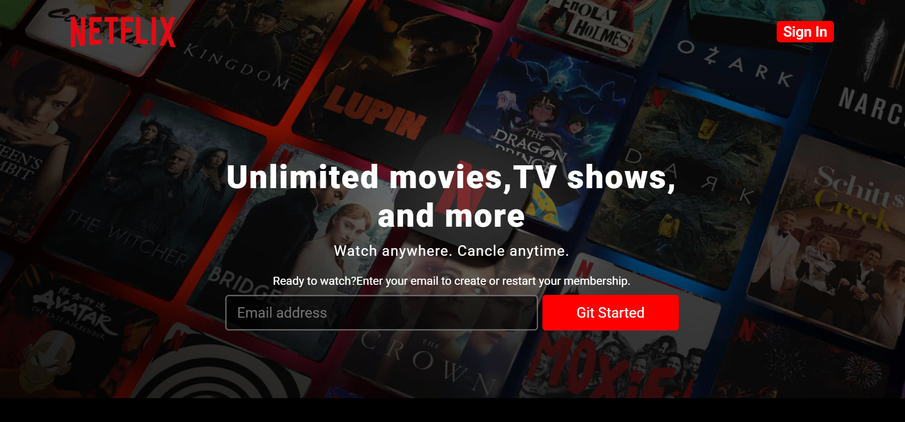
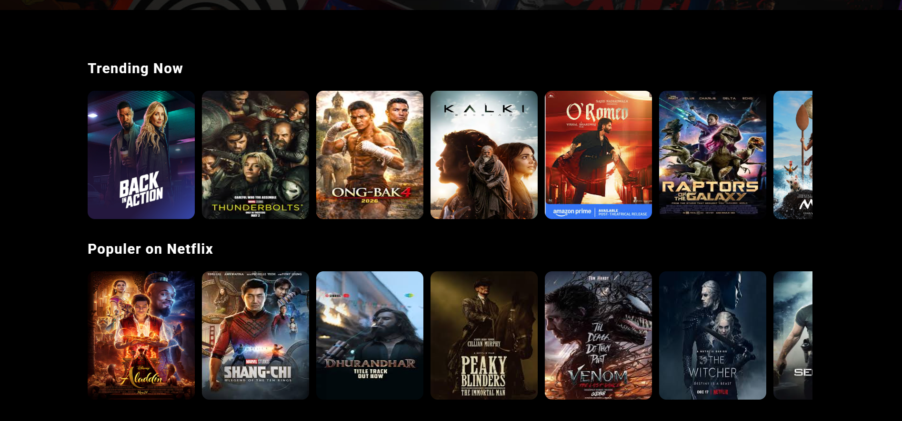
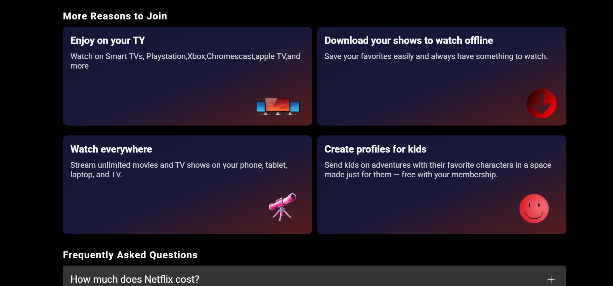
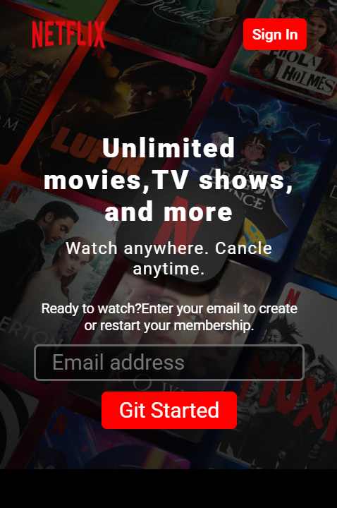
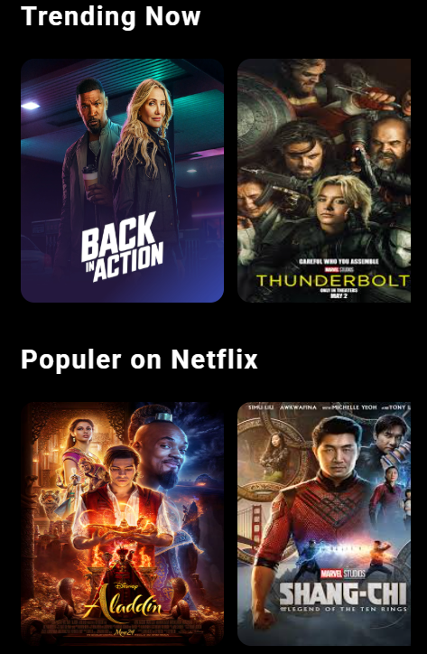
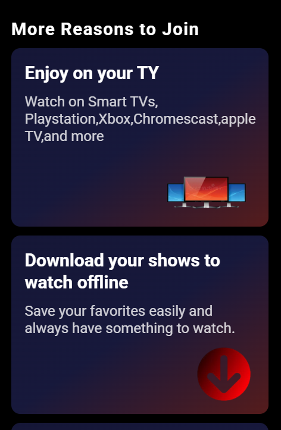

#  Netflix Clone

A fully responsive Netflix landing page clone built using pure HTML and CSS.

## 📸 Preview

### Desktop View

  
  
  

### Mobile View

  
  
  

## 🚀 Live Demo
https://mzk-flix-clone.netlify.app

## 📖 About The Project

This project is a front-end clone of Netflix's landing page. It is designed to practice responsive web design using only HTML and CSS without any JavaScript.

The layout adapts to different screen sizes including mobile, tablet, and desktop.

## ✨ Features

- Fully responsive design (Mobile, Tablet, Desktop)
- Modern UI inspired by Netflix
- Flexbox & Grid layout
- Clean and structured code
- Hover effects and smooth styling

##  🛠️ teachnologies Used
- **HTML**: For structuring 
- **CSS:** For styling and responsiveness

## 📚 What I Learned

- Responsive design techniques
- Using Flexbox and Grid effectively
- Structuring clean HTML & CSS code

## ⚙️ How to Run

1. Download or clone the repository
2. Open index.html in your browser

## 👨‍💻 Author

- [Muhammad Zeeshan Khan] (https://github.com/mzeeshankhan-dev)
